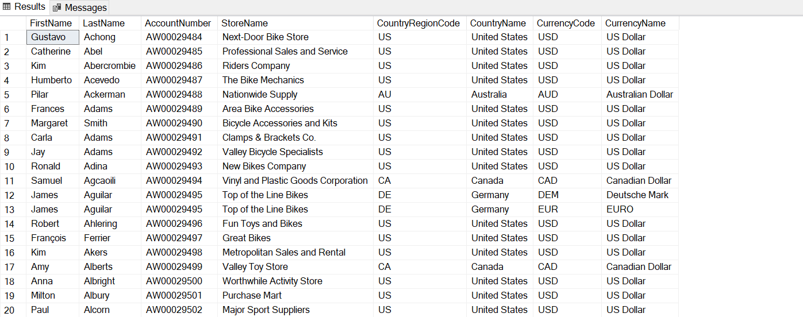
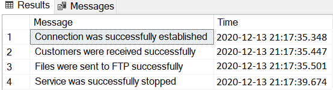
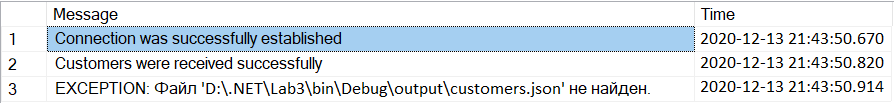

# Лабораторная работа 4

## Исиченко Егор 953505

## Что делает программа?

Во-первых, это Windows-служба. Во-вторых, для работы использовалась база данных AdventureWorks2019, которую скачал с официального сайта.

### Общий алгоритм работы:

1. Старт службы (**DataManager**)
2. Вытягиваются необходимые настройки из XML/JSON
3. Извлекаются данные из базы данных AventureWorks2019
4. Формируются на их основе XML и XSD файлы с данными
5. Эти файлы отправляются на FTP сервер (SourceDirectory из 3 лабы)
6. Служба из 3 лабы (**FileManager** - запускается **до DataManager**) дальше делает всю необходимую работу по отправке в TargetDirectory (сам сервер)
7. Все успешные действия и исключения логируются в созданную мной базу данных **ApplicationInsights** и по окончании работы данные записываются в XML файл и создается XSD
8. Конец работы **DataManager**

## Как реализовано?

### Со стороны SQL:

Я заджойнил 7 таблиц которые связаны друг с другом внешним ключом и вывел необходимые колонки и так получил таблицу покупателей в разных магазинах, которые отсортированы по их номеру счета (всего 701 запись как можете видеть в правом нижнем углу):



Запрос к базе данных выглядит вот так:



Потом я из этого запроса сделал хранимую процедуру sp_GetCustomers, которая выглядит вот так:



Ее мы и будем использовать в коде C#, т.к. это более безопасно и производительно.

База данных **ApplicationInsights** - туда в таблицу **Insights** логируются исключения и успешные действия в программе в таком виде (без исключений):


С исключением:


Также сделал хранимые процедуры для добавления записи, очистки таблицы и получения всех данных которые будем использовать в коде C# для ведения лога:


### Со стороны C#:

Т.к. работает две службы одновременно и все они вытягивают настройки через **ConfigManager**, который я делал в 3 лабораторной, то для удобства сделал *class library* **ServiceLibrary** (все содержимое находится в соответствующей папке) и добавил туда из 3 лабораторной *ConfigManager*, xml и  json парсеры и подключаю проект как зависимость к обеим службам.

Объект настроек для нашего **DataManager** - класс **DataOptions** (пример xml и json файлов настроек в папке **dataOptions**)

```c#
public class DataOptions
{
    public string ConnectionString { get; set; }

    public string LoggerConnectionString { get; set; }

    public string SourcePath { get; set; }

    public string OutputFolder { get; set; }

    public DataOptions() { }
}
```

* **ConnectionString** - строка для подключения к базе данных

* **LoggerConnectionString** - строка для подключения к базе данных логгера

* **SourcePath** - путь к FTP

* **OutputFolder** - папка, где изначально будут создаваться XML файлы с данными БД и XML файлы из БД логгера. Оттуда и будут пересылаться в *SourcePath* наши файлы.

Новая папка в **ServiceLibrary** - *DataClasses* в которой находятся классы для работы с БД.

Первый класс в ней - **DataIO**, с помощью которого мы можем добавлять, удалять, читать данные в БД *ApplicationInsights* и читать данные из *AdventureWorks2019*. В качестве *sql* команд используются хранимые процедуры, которые описаны выше. Все операции проходят в рамках *transaction scope*, то есть если будет какая-то ошибка, произойдет *rollback*, если все успешно - *commit* в базу данных. Также предусмотрел случай, когда исключение происходит на этапе подключения или работы с *ApplicationInsights*, тогда данные об исключении записываются в файл *Exceptions.txt*.

Второй класс - **FileTransfer** принимает в конструктор *OutputFolder* и *SourcePath* и перемещает *fileName* на FTP с помощью метода *SendFileToFtp*.

Третий класс - **XmlGenerator**. Название говорит само за себя - генерирует XML файл в *OutputFolder*. Для этого использует *DataSet* - база данных и дает имя файлу *fileName*. Все делается с помощью метода WriteToXml. Также генерируется рядом с XML файлом XSD файл, валидирующий его.

Теперь переместимся в корневой каталог. Здесь находятся файлы в которых все выше перечисленное используется.

* **Program.cs** - точка входа в приложение. Там вытягивается конфигурация от сервиса и запускается сам **DataManger**. Также там осуществляется подключение к базе данных **ApplicationInsights**, куда записываются все действия и исключения в программе. Если исключение возникло раньше подключения или во время его, то они логируются в файл *Exceptions.txt*.

* **DataManager.cs** - сама служба. В конструктор передаем конфигурацию и объект *appInsights* - объект DataIO. Далее в событии OnStart() создается еще один объект *DataIO* *reader*, который читает данные из БД *AdventureWorks2019* с помощью метода *GetCustomers*. Также этот метод формирует XML и XSD файлы. Далее происходит отправка на FTP двух файлов.

Параллельно с этим ведется лог в БД *ApplicationInsights* и по окончании работы службы из нее тоже формируется XML и XSD файл в *OutputFolder* для чтения данных с помощью текстового редактора.
